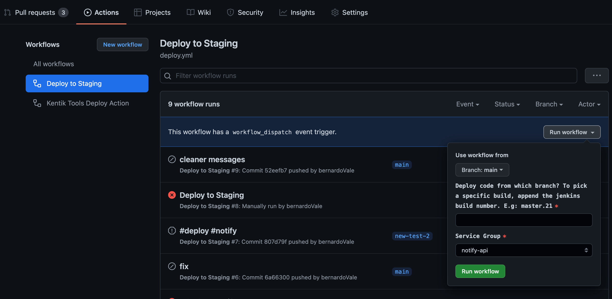

# Deploying via the Github UI

Github provides the ability to trigger a workflow manually using the event type `workflow_dispatch`. You can trigger it via API and also using the UI.

Example:

```yaml
name: Deploy

on:
  push:
  workflow_dispatch:
    inputs:
      branch:
        description: 'Deploy code from which branch? To pick a specific build, append the jenkins build number. E.g: master.21'
        required: true
      environment:
        description: Environment name
        required: true
        default: our1
        options: ["production", "fra1", "our1", "dfw1", "jp1", "yyz1", "hrd1", "hnd1", "bct1", "buf1", "nez1", "nrt1"]
        type: choice
      service_group:
        description: 'Service Group'
        required: true
        default: 'notify-api' 
        type: choice
        options:
          - notify-api
          - notify-worker
jobs:
  manual_deploy:
    uses: kentik/github-workflows/.github/workflows/deploy_manually.yml@main
    if: github.event_name == 'workflow_dispatch'
    with:
      service_group: ${{ github.event.inputs.service_group }}
      branch: ${{ github.event.inputs.branch }}
```

With this configuration, the workflow can now be triggered via API or in the UI. All declared inputs will show up in the UI so that the user can set the values:



Note that we also define a condition to the `manual_deploy` job, this is important if you want to combine manual and automated deployments in the same workflow deploy. Example:

```yaml
name: Deploy

on:
  push:
  workflow_dispatch:
    inputs:
      branch:
        description: 'Deploy code from which branch? To pick a specific build, append the jenkins build number. E.g: master.21'
        required: true
      environment:
        description: Environment name
        required: true
        default: our1
        options: ["production", "fra1", "our1", "dfw1", "jp1", "yyz1", "hrd1", "hnd1", "bct1", "buf1", "nez1", "nrt1"]
        type: choice
      service_group:
        description: 'Service Group'
        required: true
        default: 'notify-api' 
        type: choice
        options:
          - notify-api
          - notify-worker

jobs:
  deploy_notify:
    uses: kentik/github-workflows/.github/workflows/deploy.yml@main
    if: contains(github.event.head_commit.message, '#notify') 
    with:
      service_group: notify-api

  deploy_worker:
    uses: kentik/github-workflows/.github/workflows/deploy.yml@main
    if: contains(github.event.head_commit.message, '#notify-worker') 
    with:
      service_group: notify-worker

  manual_deploy:
    uses: kentik/github-workflows/.github/workflows/deploy_manually.yml@main
    if: github.event_name == 'workflow_dispatch'
    with:
      service_group: ${{ github.event.inputs.service_group }}
      branch: ${{ github.event.inputs.branch }}
      branch: ${{ github.event.inputs.environment }}
```
